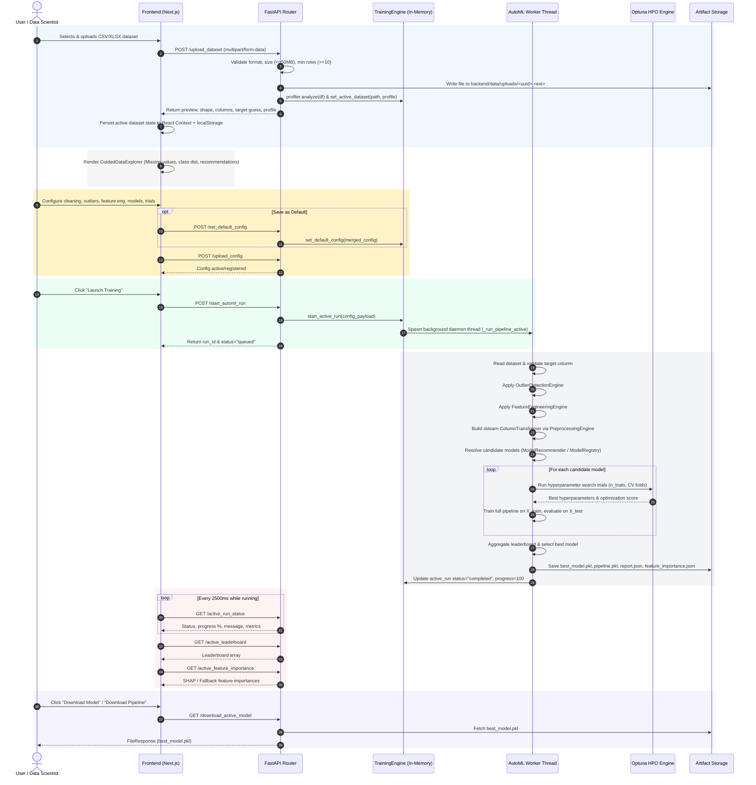

# neko-matic: Detailed End-to-End Project Workflow & System Architecture

## 1. Executive Summary & System Overview

**neko-matic** is a modular, production-grade Automated Machine Learning (AutoML) platform designed to automate the tabular data modeling lifecycle—from raw file ingestion to feature engineering, hyperparameter tuning, model evaluation, explainability, and artifact export.

The system is built as a single-session control plane optimized for a **unified active workflow**, eliminating manual user management of dataset identifiers and run IDs.

```
┌──────────────────────────────────────────────────────────────────────────────────┐
│                             FRONTEND (Next.js Dashboard)                         │
│   Unified /training UI • Guided Explorer • Dynamic Presets • Live Progress Monitor│
└────────────────────────────────────────┬─────────────────────────────────────────┘
                                         │ HTTP REST API (Fetch)
                                         ▼
┌──────────────────────────────────────────────────────────────────────────────────┐
│                               BACKEND API (FastAPI)                              │
│   /upload_dataset • /active_dataset • /start_automl_run • /active_run_status      │
│   /active_leaderboard • /active_feature_importance • /download_active_model      │
└────────────────────────────────────────┬─────────────────────────────────────────┘
                                         │ Thread-safe State Manager
                                         ▼
┌──────────────────────────────────────────────────────────────────────────────────┐
│                             BACKEND ML ENGINE (core)                             │
│   DataProfiler ➔ OutlierEngine ➔ FeatureEngineering ➔ PreprocessingEngine        │
│   ModelRegistry ➔ Optuna HyperparameterOptimizer ➔ EvaluationEngine ➔ SHAPExplainer│
└────────────────────────────────────────┬─────────────────────────────────────────┘
                                         │ Disk I/O (joblib / JSON)
                                         ▼
┌──────────────────────────────────────────────────────────────────────────────────┐
│                            ARTIFACT STORAGE (models/ & data/)                    │
│   models/runs/<run_id>/ (best_model.pkl, pipeline.pkl, training_report.json)     │
│   backend/data/uploads/<uuid>.<ext>                                             │
└──────────────────────────────────────────────────────────────────────────────────┘
```

---

## 2. End-to-End User & Data Lifecycle Workflow



---

## 3. Core Component Architecture & Technical Workflow

### 3.1 Dataset Ingestion & Profiling Module (`backend/api/routes_datasets.py` & `backend/core/profiler.py`)

- **File Validation**: Enforces maximum file size limit ($50\text{ MB}$), file extension check (`.csv`, `.xlsx`, `.xls`), and minimum row threshold ($\ge 10\text{ rows}$).
- **Data Profiling**: `DataProfiler` performs comprehensive initial inspection:
  - Infers dataset shape and column data types (numerical vs. categorical).
  - Calculates missing value counts and percentages per column.
  - Detects target column candidates (defaulting to the last column if unspecified).
  - Computes class distribution for classification targets.
  - Generates Pearson correlation matrix for numerical features.
- **Active State Update**: Calls `TRAINING_ENGINE.set_active_dataset(path, profile)` to store dataset metadata in memory for single-session UI operations.

### 3.2 Guided Data Exploration & Meta-Learning Presets (`frontend/components/GuidedDataExplorer.tsx` & `backend/meta_learning/`)

- **Smart Recommendation Engine**: Rules-based advisory system analyzing dataset statistics:
  - *Missing Values Rule*: Suggests median/mode imputation if total missing values $>0$.
  - *Class Imbalance Rule*: Detects target class imbalance (max class % $-$ min class % $> 50\%$) and suggests F1-score metric and stratified CV.
  - *Dataset Scale Rule*: Recommends reducing CV folds for small datasets ($<100$ rows) or enabling parallel training/sampling for large datasets ($>100,000$ rows).
  - *High Dimensionality Rule*: Warns when feature count $>50$ and advises enabling feature selection.
- **Meta-Learning Recommender**: `ModelRecommender` computes dataset meta-features (row count, feature ratio, missing ratio, categorical ratio) to intelligently prioritize candidate algorithms before training starts.

### 3.3 Pipeline Configuration & Parameter Merging (`backend/utils/config_loader.py` & `backend/configs/default.yaml`)

- Configurations use a structured JSON/YAML hierarchy merging default system presets with user overrides:
  - `dataset_settings`: Target column name, problem type override, train/test split ratio (default: 0.2), cross-validation folds (default: 5).
  - `data_cleaning`: Imputation strategy (`median`, `mean`, `most_frequent`), categorical encoding (`onehot`, `label`), feature scaling (`standard`, `minmax`, `none`).
  - `outlier_removal`: Methods (`none`, `zscore`, `iqr`, `isolation_forest`) with customizable parameters.
  - `feature_engineering`: Log transforms, polynomial interaction features, and feature selection (`variance_threshold`, `mutual_information`, `recursive_feature_elimination`).
  - `hyperparameter_optimization`: Optuna optimizer settings (trial count, timeout, early stopping).
  - `explainability`: SHAP explanation toggle (`enable_shap`).

### 3.4 Asynchronous Training Execution Engine (`backend/core/trainer.py` & `backend/core/automl_trainer.py`)

- **Concurrency Model**: Training runs execute inside isolated `threading.Thread` worker threads with daemon lifecycle. Thread-safe operations on shared state are protected by `threading.Lock`.
- **Execution Phases**:
  1. **Data Loading**: File reading via Pandas (`read_csv` / `read_excel`).
  2. **Outlier Filtering**: `OutlierDetectionEngine` trims noisy outliers from training features.
  3. **Feature Generation**: `FeatureEngineeringEngine` generates log transforms, interaction terms, or variance-filtered features.
  4. **Sklearn Pipeline Construction**: `PreprocessingEngine` constructs a scikit-learn `ColumnTransformer` combining imputers, encoders, and scalers.
  5. **Model Registry Resolution**: `ModelRegistry` resolves supported model specs:
     - *Classification*: `LogisticRegression`, `RandomForestClassifier`, `GradientBoostingClassifier`, `XGBClassifier`, `LGBMClassifier`, `SVC`, `KNeighborsClassifier`, `GaussianNB`.
     - *Regression*: `LinearRegression`, `Ridge`, `Lasso`, `RandomForestRegressor`, `GradientBoostingRegressor`, `XGBRegressor`, `LGBMRegressor`, `SVR`.
  6. **Optuna Hyperparameter Tuning**: `HyperparameterOptimizer` executes $N$ Optuna trials per algorithm, maximizing CV score.
  7. **Full Pipeline Training**: Fits the best hyperparameters on `X_train` and evaluates holdout metrics on `X_test`.
  8. **Leaderboard Aggregation**: `LeaderboardManager` ranks all evaluated models by primary metric.

### 3.5 Model Explainability & SHAP Engine (`backend/explainability/shap_explainer.py`)

- Computes global feature importance using SHAP:
  - Uses `shap.TreeExplainer` for tree-based models (`RandomForest`, `GradientBoosting`, `XGBoost`, `LightGBM`).
  - Uses `shap.KernelExplainer` with sub-sampled background data for non-tree models.
- **Robust Fallback**: If SHAP computation encounters unsupported structures or missing optional dependencies, it gracefully falls back to native model feature importances (`.feature_importances_` or `.coef_`).

### 3.6 Artifact Export & Download Management (`backend/api/routes_results.py`)

- Automatically writes run artifacts to disk under `models/runs/<run_id>/`:
  - `best_model.pkl`: Serialized best scikit-learn / XGBoost / LightGBM model.
  - `pipeline.pkl`: Full fitted preprocessing + estimator pipeline.
  - `training_report.json`: JSON report containing run parameters, leaderboard metrics, and execution metadata.
  - `feature_importance.json`: Top-30 feature importances and scores.
- Exposes direct download endpoints (`GET /download_active_model`, `GET /download_active_artifact?artifact=...`) returning `FileResponse` streams to the browser.

---

## 4. Frontend Control Plane & State Architecture

### 4.1 React Context & Local Storage Synchronization (`frontend/lib/DatasetContext.tsx`)

State management relies on React `useReducer` wrapped in a custom `DatasetProvider`:
- **State Schema**:
  - `dataset`: Information on active dataset (shape, columns, target, preview, profile).
  - `run`: Information on active run (status, progress, message, metrics, leaderboard).
- **Persistence**: Automatically synchronizes `dataset` and user configuration presets to `localStorage` (`neko-matic.active_dataset`, `neko-matic.default_config`), ensuring state recovery on browser refresh.

### 4.2 Unified Training Page (`frontend/app/training/page.tsx`)

The dashboard organizes the workflow into four intuitive tabs:
1. **Upload**: Drag-and-drop file upload interface with real-time feedback and validation error display.
2. **Explore**: Embedded `GuidedDataExplorer` displaying interactive data quality metrics, distribution charts (Recharts), and smart recommendation cards.
3. **Configure**: Accordion-based configuration form allowing fine-tuning of pipeline parameters with a "Save as Default" button for non-technical users.
4. **Monitor & Results**: Live progress progress-bar, execution log feed, real-time leaderboard comparison table, SHAP feature importance chart, and artifact download buttons.

---

## 5. Static Analysis & Code Quality Verification

A complete static analysis and automated verification of the entire codebase was executed:

| Target Component | Tool / Command | Verification Result | Status |
| :--- | :--- | :--- | :---: |
| **Backend Test Suite** | `pytest` | **22 / 22 unit tests passed** cleanly ($12.60\text{s}$) | `PASSED` |
| **Backend Syntax Check** | `compileall backend` | All Python backend modules compiled with **0 errors** | `PASSED` |
| **Frontend Type Checking** | `tsc --noEmit` | **0 TypeScript errors** across app, components, and lib | `PASSED` |
| **Frontend Production Build**| `npm run build` | Next.js production build succeeded cleanly | `PASSED` |

### Key Code Quality & Safety Findings
- **Thread Safety**: All state access in `TrainingEngine` is safely locked using `threading.Lock()`.
- **Async Non-blocking Design**: Heavy ML compute occurs in background daemon threads, preventing API route blocking.
- **Graceful Error Handling**: Custom exception hierarchy in `backend/core/exceptions.py` maps domain errors (`NoDatasetError`, `ColumnNotFoundError`, `DatasetFormatError`) directly to clean HTTP error status codes.
- **Zero Schema Mismatches**: API payloads match exact expected types across frontend `lib/api.ts` and backend Pydantic models.
